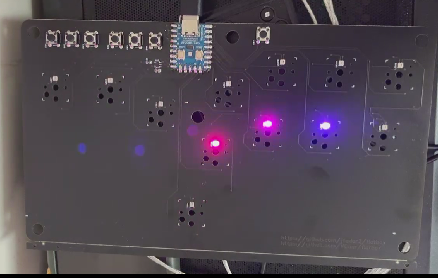
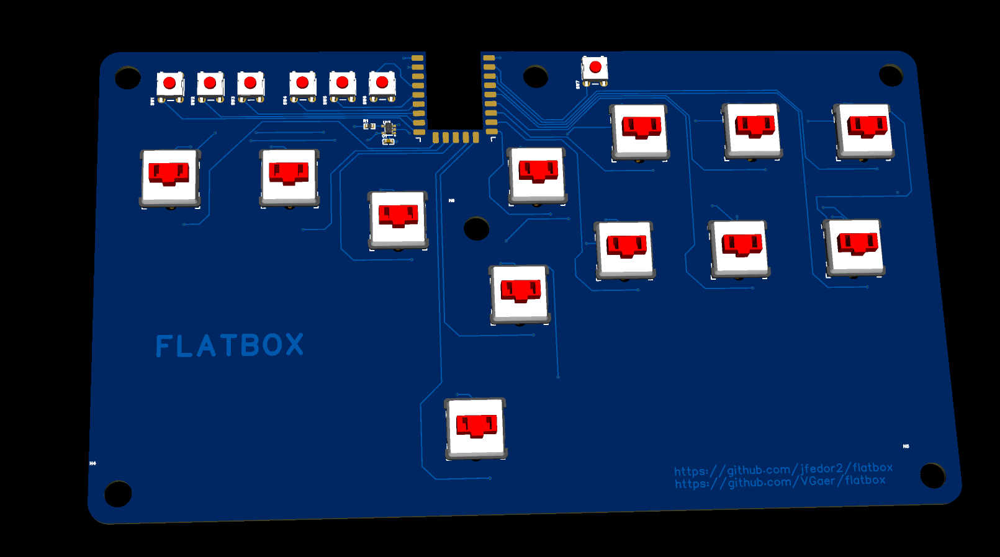
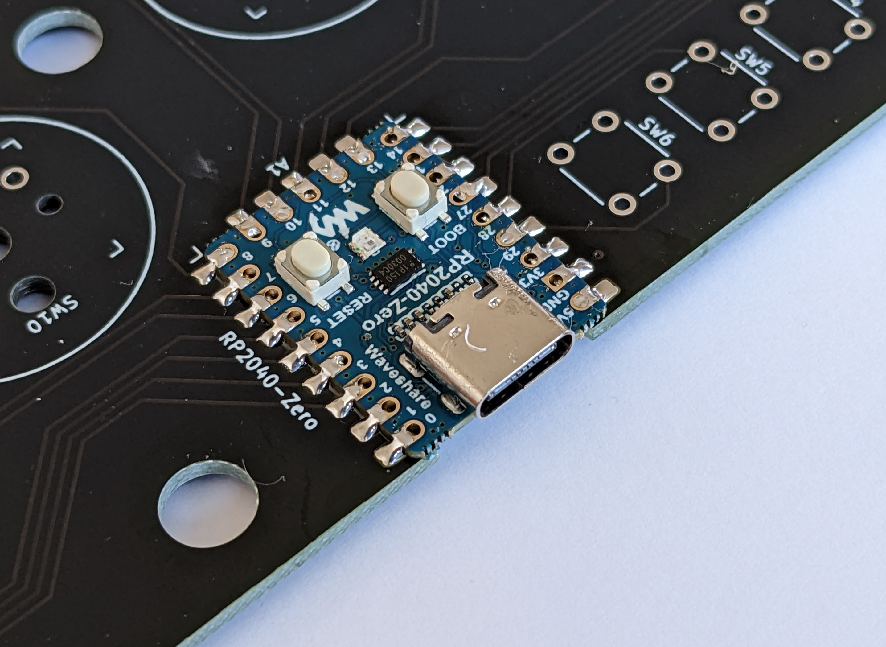

# Flatbox rev5

This is rev5 of the Flatbox. In this version an [RP2040-Zero](https://www.waveshare.com/rp2040-zero.htm) board is soldered onto the main PCB.

To make one you will need:

* [3D printed case parts](3d-printed-case) - top and bottom
* [the Flatbox PCB](pcb)
* [RP2040-Zero](https://www.waveshare.com/rp2040-zero.htm)
* 12x Kailh low profile (choc v1) switches of your choice
* 12x Kailh low profile hotswap sockets
* [3D printed buttoncaps](../3d-printed-buttoncaps)
* 6x 6x6x5mm tact switches
* 7x M3x6 flat head screws
* some kind of rubber feet or non-slip padding for the bottom
* a soldering iron

I printed the case at 0.20mm layer height. The top part should be printed upside-down, the bottom part should be printed as-is. They don't require supports.

The PCB can be ordered from a number of online services using the included [Gerber files](pcb), I used [JLCPCB](https://jlcpcb.com/) (leave all the settings at default, you can choose the PCB color). PCB thickness should be 1.6mm.

The switches can be soldered in directly to the PCB or you can use hotswap sockets. If you want to use hotswap sockets, you will have to print the appropriate bottom part of the case (it's 1mm thicker).

You don't have to use the [code](../firmware-rp2040) included here, you can use any other RP2040-compatible firmware. The included firmware works with the PS3 and PC.

To flash the firmware, connect the board to a computer with a USB cable, then press the RESET button while holding the BOOT button on the RP2040-Zero. A drive named "RPI-RP2" should appear. Copy the [flatbox-rev5.uf2](firmware/flatbox-rev5.uf2) file to that drive. That's it.

PCB design licensed under [CC BY-SA 4.0](https://creativecommons.org/licenses/by-sa/4.0/).

PCB design uses the following:

* [keyswitches.pretty](https://github.com/daprice/keyswitches.pretty) by [daprice](https://github.com/daprice) ([CC BY-SA 4.0](https://creativecommons.org/licenses/by-sa/4.0/))
* RP2040-Zero STEP file downloaded from [Waveshare wiki](https://www.waveshare.com/wiki/RP2040-Zero)
